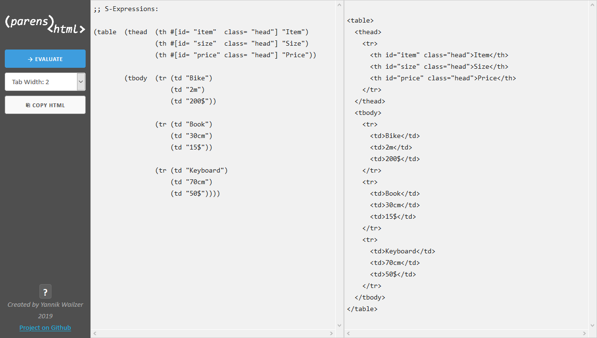

# parens2html
> A simple website for generating HTML out of S-Expressions (Lisp style) [Try it out!](https://tryops.github.io/parens2html/)

## S-Expressions to HTML
This page uses a Scheme implementation in JavaScript _([Biwa Scheme](https://www.biwascheme.org/))_ and a simple 
list manipulation script, to convert **S-Expressions to plain HTML**. 

S-Expressions as markup can be: 
- simpler to read 
- easier/faster to write _(especially in an early phase of rapid development and prototyping)_
- less redundant _(only **one** tag name)_

## How it works
It's pretty simple:
- Write your markup in S-Expressions
- Paste it into the first s-expression code-box
- Press the **EVALUATE** button
- **Copy** the output HTML and use it as markup

## How to markup
Every HTML tag is written in parenthesis like this: `(div "Content...")`

- The tag-name is written on the beginning after the opening paren, the contents follow after it **seperated by spaces** until the closing paren.
- Text is written in **double quotes** _(to differentiate them from tag-names)_: `"..."`
- Tags can be in the contents of other tags _(nested)_:  
  <code>(div **_(h2 "Title...)_** **_(p "1st paragraph...")_** **_(p "2nd paragraph...")_**)</code>
- Attributes are written **directly after the tag-name** in parens with a **`#`** in front of it:  
  <code>(div **#(id= "first" class= "space center")** "Text...")</code>
  
  To better distinguish them from tags, you can also use brackets **`#[]`** for attributes:  
  <code>(div **#[id= "first" class= "space center"]** "Text")</code>

Also see the demo example as a reference on how to write HTML with it. 
[Try it out](https://tryops.github.io/parens2html/) and have fun!
